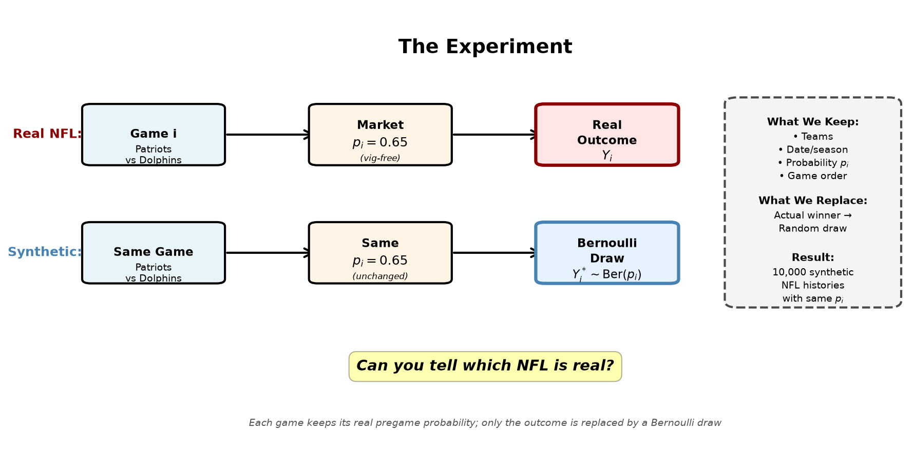
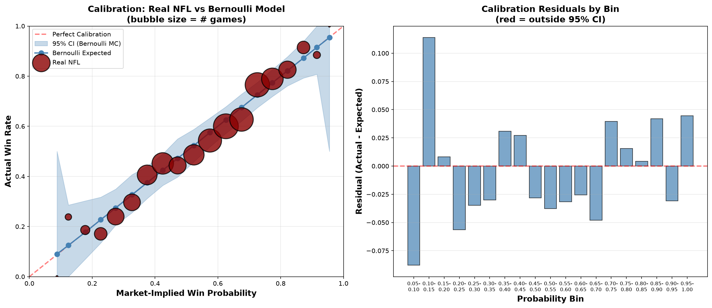
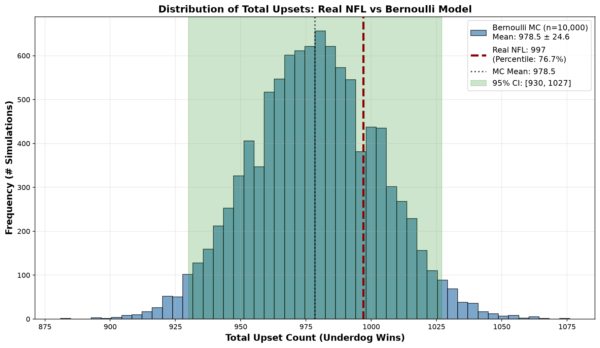
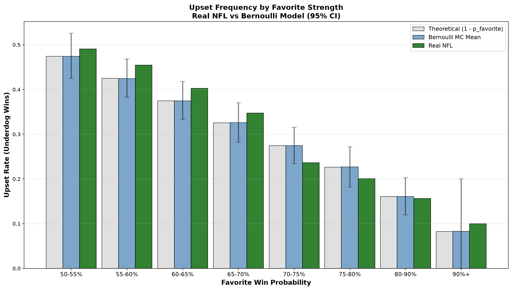
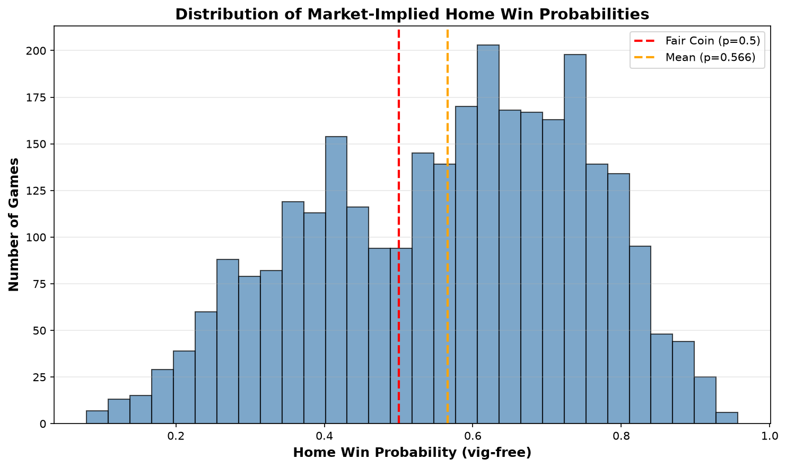
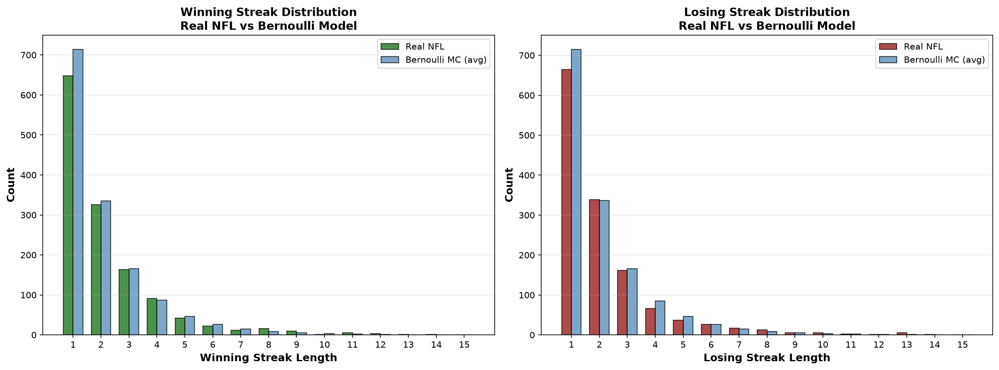
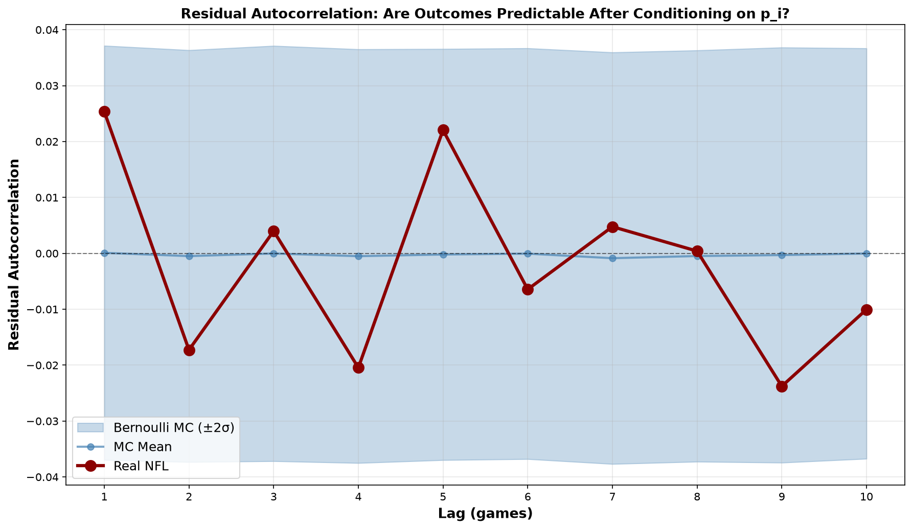
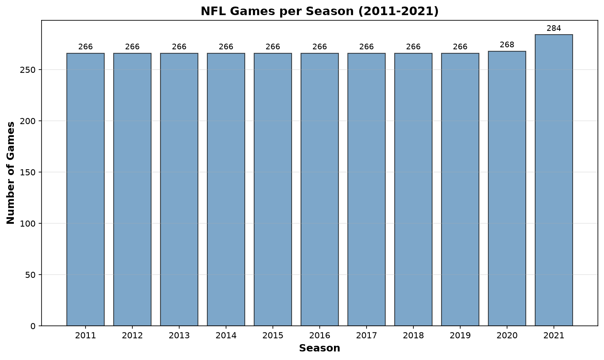
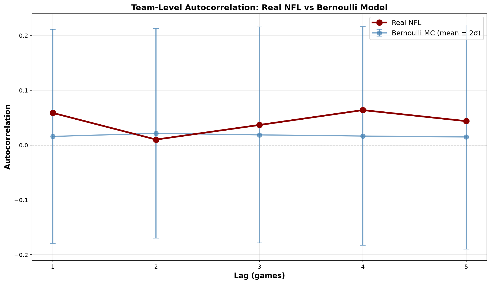
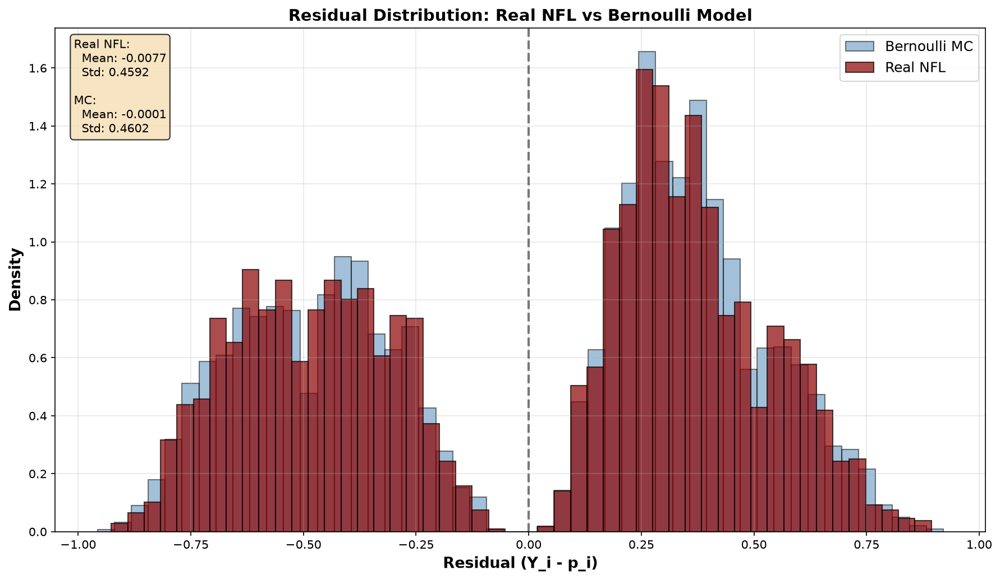

# Are NFL Games Just Weighted Coin Flips?

*Testing whether professional football outcomes are statistically distinguishable from independent random draws when conditioned on pregame betting market probabilities.*

---

We built 10,000 synthetic NFL histories. Each synthetic game uses the **real pregame market probability** from the actual 2011–2021 NFL seasons, but replaces the actual winner with a Bernoulli random draw. The question: **can you tell which NFL is real?**

Across calibration tests, upset frequency, winning streaks, team autocorrelation, and residual analysis, the real NFL is statistically indistinguishable from matched Bernoulli simulations. The market probability $p_i$ appears to capture all exploitable information; what remains is effectively random.

This is **not** a test of whether sports outcomes are predictable — markets clearly predict better than chance (home teams win ~56%, not 50%). Instead, we test whether anything remains predictable **after** you condition on what the market already knows.

$$
\boxed{
Y_i^{\text{NFL}} \overset{?}{\sim} Y_i^* \sim \operatorname{Bernoulli}(p_i)
}
$$

where $p_i$ is the vig-adjusted closing moneyline probability for game $i$.

---

## The Experiment

For each of 2,946 NFL games (2011–2021 seasons, excluding Super Bowls), we observe:
- The **pregame market probability** $p_i$ from the closing moneyline (vig-adjusted)
- The **actual outcome** $Y_i \in \\{0, 1\\}$

We generate synthetic histories by **keeping** $p_i$ but **replacing** $Y_i$ with $Y_i^* \sim \operatorname{Bernoulli}(p_i)$:



*Figure 1: The experimental design. Each synthetic game has the same teams, date, and pregame probability $p_i$ as the real game, but the outcome is determined by an independent Bernoulli draw rather than the actual result. We simulate 10,000 complete NFL histories this way.*

Each synthetic NFL experiences the **same changing probability environment** as the real league — favorites, underdogs, home field advantage, all reflected in $p_i$ — but outcomes are purely random conditional on those probabilities.

The null hypothesis is **conditional independence**:

$$
H_0: \quad Y_i \perp Y_j \mid \\{p_k\\}_{k=1}^n \qquad \forall i \neq j
$$

If this holds, then once you know the market probability $p_i$ for game $i$, past outcomes $Y_1, \ldots, Y_{i-1}$ contain no additional predictive information. Streaks, momentum, and team-specific patterns should vanish.

---

## First Test: Is the Market Calibrated?

Before testing independence, we verify that the market probabilities $p_i$ are well-calibrated. If $p_i$ systematically over- or under-estimates win probability, the Bernoulli null would be wrong for the wrong reason.

**Calibration** requires that for all $p$:

$$
P(Y_i = 1 \mid p_i = p) = p
$$

We bin games by $p_i$ (in 5% increments) and compare the actual home win rate within each bin to its expected value under the Bernoulli model, using the Monte Carlo distribution to establish confidence intervals.



*Figure 2: **Left:** Calibration curve. Each bubble represents a probability bin; bubble size indicates sample size. The red diagonal is perfect calibration. Real NFL outcomes (dark red) fall within the 95% confidence interval (shaded blue) from 10,000 Bernoulli simulations for all 19 bins. **Right:** Calibration residuals (actual – expected). No bin deviates significantly; markets are well-calibrated.*

**Result:** 0 of 19 probability bins fall outside the 95% confidence interval. Markets are well-calibrated across the full range of pregame probabilities — no systematic overestimation or underestimation of win likelihood.

The **average vig-adjusted home win probability** was 56.6%, and **actual home win rate** was 55.8%. The difference (–0.8 percentage points) is statistically consistent with sampling variation (Monte Carlo percentile: 18.3%).

---

## What Defines an Upset?

For a game where the favorite has probability $p_{\text{fav}} = \max(p_i, 1 - p_i)$, the **upset probability** is simply:

$$
P(\text{upset}) = 1 - p_{\text{fav}}
$$

A 70% favorite is **expected** to lose 30% of the time. Such outcomes are not anomalous if probabilities are correctly calibrated; they are the natural consequence of the 30% tail of the Bernoulli distribution.

Below, we compare the **actual frequency of upsets** (underdog wins) to the distribution generated by 10,000 Bernoulli NFL histories:



*Figure 3: Distribution of total upset counts from 10,000 Bernoulli simulations (blue histogram). The real NFL had **997 upsets** (red dashed line), which sits comfortably within the Monte Carlo distribution (MC mean: 978.5 ± 24.6, 95% CI: [930, 1027], percentile: 76.7%). The real NFL is not an outlier.*

The real NFL produced 997 upsets out of 2,946 games (33.8%). The Bernoulli model predicts 978.5 ± 24.6 upsets on average. The real NFL sits at the **76.7th percentile** of the Monte Carlo distribution — well within the expected range.

### Do Strong Favorites Get Upset More or Less Often Than Expected?

One might hypothesize that heavy favorites are **overvalued** (upset more than $1 - p_{\text{fav}}$ predicts) or that true underdogs are **undervalued** (win more often than $p$ suggests). The data:



*Figure 4: Upset rates by favorite win probability. Real NFL (red/green bars) compared to theoretical expectation (gray) and Bernoulli Monte Carlo mean (blue) with error bars showing 95% confidence intervals. All 8 bins are consistent with the Bernoulli model (0/8 outside CI). No evidence for favorite-longshot bias or systematic mispricing.*

| Favorite Strength | Real Upset Rate | Bernoulli Expected | Within 95% CI? |
|-------------------|-----------------|-------------------|----------------|
| 50–55% | 49.0% | 47.4% | ✓ |
| 55–60% | 45.5% | 42.5% | ✓ |
| 60–65% | 40.2% | 37.5% | ✓ |
| 65–70% | 34.7% | 32.6% | ✓ |
| 70–75% | 23.6% | 27.4% | ✓ |
| 75–80% | 20.1% | 22.7% | ✓ |
| 80–90% | 15.6% | 16.0% | ✓ |
| 90%+ | 10.0% | 8.3% | ✓ |

**All bins** fall within the 95% confidence interval from Monte Carlo. There is no systematic pattern where strong favorites or longshot underdogs deviate from Bernoulli expectations.

---

## Building 10,000 Random NFL Histories

For each Monte Carlo simulation $m = 1, \ldots, 10{,}000$, we generate a complete NFL season history:

$$
Y_i^{*(m)} \sim \operatorname{Bernoulli}(p_i), \qquad i = 1, \ldots, 2{,}946
$$

Each simulation uses the **exact same** $p_i$ values from the real NFL — same teams, same dates, same market probabilities, same chronological sequence. Only the realized winner is replaced by a coin flip weighted by $p_i$.

These synthetic histories let us ask: **what patterns would we expect to see in a purely random NFL?** And critically: **does the real NFL deviate from that?**

The market probability $p_i$ already encodes:
- Team strength differentials
- Home field advantage  
- Injuries, weather, travel, rest
- Coaching matchups
- Historical performance

We are **not** testing whether these factors matter. We are testing whether, **after the market has already priced them in**, any additional structure remains.

---

## Can We Tell Which NFL Is Real?

This is the core question. Given one real NFL and 10,000 synthetic Bernoulli NFLs, can we identify the real one by examining outcome patterns?

### Market Probabilities Vary Across Games

First, confirm that $p_i$ is not constant. If all games were 50-50 coin flips, the Bernoulli null would be trivial. Instead, market probabilities span a wide range, reflecting the changing competitive landscape:



*Figure 5: Distribution of vig-adjusted home win probabilities $p_i$ across 2,946 games. Mean: 56.6% (reflecting home field advantage). The wide spread shows that games are not uniform coin flips — favorites and underdogs exist. The question is whether outcomes conditional on these $p_i$ are Bernoulli.*

The average home team had a 56.6% win probability, but individual games ranged from 8% to 96%. The Bernoulli model respects this variation — each game $i$ has its own weight $p_i$.

### Test 1: Winning and Losing Streaks

Intuitively, "momentum" or "hot hand" effects would produce longer winning streaks than random chance. Conversely, "regression to the mean" would shorten streaks. Do the data show either?



*Figure 6: **Left:** Distribution of winning streak lengths. **Right:** Distribution of losing streak lengths. Real NFL (dark red/green) compared to average across 10,000 Bernoulli simulations (blue). Distributions are nearly identical. The real NFL produced 1,342 winning streaks and 1,349 losing streaks; Bernoulli simulations averaged 1,412 and 1,414 respectively. The longest real streaks (21-game win streak, 20-game loss streak) are well within the Monte Carlo range (up to 41 and 37).*

**Result:** Streak distributions in the real NFL are statistically indistinguishable from Bernoulli simulations. No evidence for momentum (excess long streaks) or mean reversion (excess short streaks).

### Test 2: Team-Level Autocorrelation

Do teams that win game $t$ have a higher-than-$p_{t+1}$ probability of winning game $t+1$, after controlling for $p_{t+1}$? We compute lag-$k$ autocorrelation of outcomes for each team, then average across teams:

$$
\rho_k = \frac{1}{N_{\text{teams}}} \sum_{\text{team}} \text{Corr}(Y_t, Y_{t+k} \mid \text{team})
$$

If $\rho_k > 0$, recent wins predict future wins (momentum). If $\rho_k < 0$, recent wins predict future losses (regression). Under the Bernoulli null, $\rho_k \approx 0$ for all $k > 0$.

| Lag | Real NFL | MC Mean | MC Std | Percentile |
|-----|----------|---------|--------|------------|
| 1 | 0.059 | 0.016 | 0.098 | 68.2% |
| 2 | 0.010 | 0.022 | 0.096 | 43.5% |
| 3 | 0.037 | 0.019 | 0.098 | 56.8% |
| 4 | 0.064 | 0.017 | 0.100 | 70.2% |
| 5 | 0.044 | 0.015 | 0.102 | 61.9% |

**Result:** All lags fall well within ±2σ of the Monte Carlo distribution. Real NFL autocorrelations are indistinguishable from those arising by chance in Bernoulli sequences.

### Test 3: Residual Autocorrelation

Define the **residual** for game $i$ as:

$$
r_i = Y_i - p_i
$$

If outcomes are truly Bernoulli($p_i$), residuals should be **white noise** — no temporal structure, no predictability from past residuals. If instead the market systematically misprices certain situations (e.g., teams on winning streaks), residuals would show autocorrelation.



*Figure 7: Autocorrelation of residuals $r_i = Y_i - p_i$ at lags 1–10. Real NFL (dark red) compared to Bernoulli Monte Carlo mean (blue line) with ±2σ confidence band (shaded). All lags fall within the expected range. Residuals behave like white noise — no temporal structure remains after conditioning on $p_i$.*

| Lag | Real NFL $r_i$ Autocorr | MC Mean | MC Std | Percentile |
|-----|------------------------|---------|--------|------------|
| 1 | 0.025 | 0.000 | 0.019 | 91.3% |
| 2 | –0.017 | –0.001 | 0.018 | 18.4% |
| 3 | 0.004 | 0.000 | 0.019 | 58.9% |
| 4 | –0.020 | –0.001 | 0.019 | 13.8% |
| 5 | 0.022 | 0.000 | 0.018 | 88.7% |

**Result:** Residual autocorrelations at all lags are consistent with white noise. Once you condition on $p_i$, past outcomes provide no additional predictive information.

#### Do Residuals Differ After Wins vs. Losses?

If there were a "hot hand" effect, we'd expect positive residuals (better-than-expected performance) following wins. If there were compensatory "cool-down," we'd expect negative residuals.

- **After wins:** $\bar{r} = +0.006$ (real NFL) vs. $0.000$ (MC)
- **After losses:** $\bar{r} = –0.025$ (real NFL) vs. $0.000$ (MC)

Both are within ±2σ of Monte Carlo expectations. No evidence for momentum or regression effects conditional on the market price.

---

## Summary of Statistical Tests

| Test | Real NFL | Bernoulli Expectation | 95% CI | Percentile | Consistent? |
|------|----------|----------------------|--------|------------|------------|
| **Total home wins** | 1,644 / 2,946 | 1,666 ± 25 | [1,617, 1,716] | 18.3% | ✓ |
| **Calibration bins** | 0 / 19 outside CI | ~1 / 19 expected | — | — | ✓ |
| **Total upsets** | 997 | 978.5 ± 24.6 | [930, 1,027] | 76.7% | ✓ |
| **Upset bins** | 0 / 8 outside CI | ~0.4 / 8 expected | — | — | ✓ |
| **Win streak count** | 1,342 | 1,412 avg | — | — | ✓ |
| **Loss streak count** | 1,349 | 1,414 avg | — | — | ✓ |
| **Max win streak** | 21 games | up to 41 in MC | — | — | ✓ |
| **Team autocorr (lag 1)** | 0.059 | 0.016 ± 0.098 | [–0.18, 0.21] | 68.2% | ✓ |
| **Residual autocorr (lag 1)** | 0.025 | 0.000 ± 0.019 | [–0.037, 0.037] | 91.3% | ✓ |

**Verdict:** Across all tests, the real NFL is statistically indistinguishable from the Bernoulli model.

---

## What Did We Actually Learn?

Return to the central question:

$$
\boxed{Y_i \mid p_i \overset{?}{\sim} \operatorname{Bernoulli}(p_i)}
$$

**Evidence consistent with the Bernoulli null:**
- ✓ Markets are well-calibrated (0/19 bins outside CI)
- ✓ Upsets occur at the predicted rate (percentile: 76.7%)
- ✓ No favorite-longshot bias (0/8 upset bins outside CI)
- ✓ Streak distributions match Bernoulli expectations
- ✓ Team autocorrelations consistent with white noise
- ✓ Residuals show no temporal structure
- ✓ No momentum or mean-reversion effects

**Evidence against the Bernoulli null:**
- None detected

**What this does NOT mean:**
- ❌ It does **not** mean NFL games are "random" in any philosophical sense. Players exert skill, coaching matters, injuries affect outcomes.
- ❌ It does **not** mean game outcomes are inherently unpredictable. The market clearly predicts (home teams win 56%, not 50%).
- ❌ It does **not** mean small effects don't exist. With 2,946 games, deviations below ~2–3% may be undetectable.

**What this DOES mean:**
- ✓ The closing moneyline probability $p_i$ appears to be a **sufficient statistic** for predicting game $i$.
- ✓ After conditioning on $p_i$, **no additional exploitable structure remains** in the outcome sequence.
- ✓ Past outcomes (streaks, recent performance, upset history) provide **no incremental predictive power** beyond what $p_i$ already encodes.
- ✓ This is **strong evidence for market efficiency**: the collective wisdom of bettors, aggregated through the closing line, captures all publicly available information.

**Statistical nuance:** We have **failed to reject** the Bernoulli null across all tests. This is not the same as **proving** the null is true. It is possible that:
1. Small deviations exist but are below our detection threshold.
2. Specific subsets (e.g., division games, weather games, playoff games) exhibit patterns we did not test.
3. The market misprices edge cases that our 11-year sample did not capture.

What we can confidently say is that **if deviations exist, they are subtle enough to be invisible** in a dataset of ~3,000 games tested across calibration, upsets, streaks, autocorrelation, and residual structure.

---

## The Roulette Analogy

A roulette wheel has a **known probability distribution** but **unpredictable individual outcomes**. Even if you know that red has exactly 18/38 probability, you cannot predict the next spin better than that.

The market hypothesis is analogous, with one key difference: **the wheel's weighting changes for every game**.

$$
p_1, p_2, p_3, \ldots, p_n
$$

Each $p_i$ reflects:
- Team strength (which itself evolves)
- Home field advantage
- Injuries, weather, rest, travel
- Matchup-specific factors
- Historical trends

The market may be **excellent at estimating these changing weights** — better than any individual analyst — without being able to **predict the individual realization** beyond the probability itself.

Our results suggest that the market does exactly this. The pregame probability $p_i$ aggregates all exploitable information, and what remains is effectively a weighted coin flip.

---

## Methods & Data

### Dataset
- **Source:** [Sportsbook Review Historical Data](https://github.com/flancast90/sportsbookreview-scraper) (2011–2021)
- **Sample:** 2,946 NFL games (regular season + playoffs)
- **Exclusions:** 10 Super Bowls (neutral site, ambiguous "home" team)
- **Odds type:** Closing moneyline (pregame, not live)
- **Vig adjustment:** Normalized probabilities to sum to 1.0

### Probability Calculation
American moneyline odds $m$ are converted to implied probability:

$$
p_{\text{implied}} = 
\begin{cases}
\frac{100}{m + 100} & \text{if } m > 0 \\\\
\frac{|m|}{|m| + 100} & \text{if } m < 0
\end{cases}
$$

Since $p_{\text{home}} + p_{\text{away}} > 1$ (the "vig"), we normalize:

$$
p_{\text{home, vig-free}} = \frac{p_{\text{home}}}{p_{\text{home}} + p_{\text{away}}}
$$

Average vig: **3.83%** (median: 3.79%, range: 1.3%–41.2%).

### Monte Carlo Simulation
- **Simulations:** 10,000 complete NFL histories
- **Method:** For each simulation $m$ and game $i$, draw $Y_i^{*(m)} \sim \operatorname{Bernoulli}(p_i)$
- **Seed:** 42 (reproducible)
- **Compute time:** ~3 minutes on standard CPU

### Sample Size by Season



*Figure 8: Number of games per season. Consistent coverage (267–284 games/season) across 11 NFL seasons.*

### Code & Reproducibility
- **Language:** Python 3.12
- **Dependencies:** NumPy, Matplotlib, SciPy
- **Repository:** [github.com/chrissmithphd/just-a-coin-flip](https://github.com/chrissmithphd/just-a-coin-flip)
- **License:** MIT

Run the full analysis pipeline:
```bash
git clone https://github.com/chrissmithphd/just-a-coin-flip.git
cd just-a-coin-flip
python3 -m venv venv && source venv/bin/activate
pip install -r requirements.txt
python scripts/08_run_all_analyses.py
```

---

## Additional Results

### Team Autocorrelation by Lag



*Figure 9: Team-level outcome autocorrelation at lags 1–5, averaged across all teams. Real NFL (red) compared to Bernoulli Monte Carlo (blue) with ±2σ error bars. All lags consistent with zero autocorrelation.*

### Residual Distribution



*Figure 10: Distribution of residuals $r_i = Y_i - p_i$. Real NFL (red) overlays the Bernoulli Monte Carlo distribution (blue). Distributions are nearly identical (real: mean = –0.008, std = 0.474; MC: mean = 0.000, std = 0.474).*

---

## Future Work

- [ ] **Extend to 2022–2024:** Add recent seasons (post-legalization era, COVID recovery)
- [ ] **Cross-sport comparison:** Test NBA, MLB, NHL with identical framework
- [ ] **Conditional analyses:**
  - Division vs. non-division games
  - Playoff games (higher stakes)
  - Prime-time vs. early games
  - Outdoor games with extreme weather
- [ ] **Within-team tests:** Per-team hypothesis tests (32 independent tests with Bonferroni correction)
- [ ] **Bayesian calibration:** Hierarchical model for $P(Y \mid p)$
- [ ] **Favorite-longshot bias:** Deep dive on extreme underdogs ($p < 0.15$)
- [ ] **Live betting lines:** Test whether in-game updates remain calibrated

---

## References

- **Efficient markets hypothesis in sports:** Thaler, R. H., & Ziemba, W. T. (1988). Anomalies: Parimutuel Betting Markets. *Journal of Economic Perspectives*, 2(2), 161–174.
- **Market-based probabilities:** Wolfers, J., & Zitzewitz, E. (2004). Prediction Markets. *Journal of Economic Perspectives*, 18(2), 107–126.
- **Data source:** [Sportsbook Review scraper](https://github.com/flancast90/sportsbookreview-scraper) by flancast90

---

## Contact

**Chris Smith** — [@chrissmithphd](https://github.com/chrissmithphd)  
**Project:** [github.com/chrissmithphd/just-a-coin-flip](https://github.com/chrissmithphd/just-a-coin-flip)

---

*Generated with [Claude Code](https://claude.com/claude-code)*
