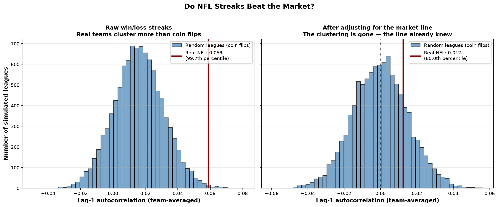
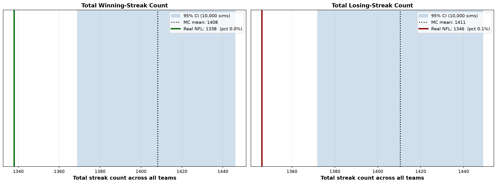

# Are NFL Games Just Weighted Coin Flips?

*Testing whether professional football outcomes are statistically distinguishable from independent random draws when conditioned on pregame betting market probabilities.*

---

We built 10,000 synthetic NFL histories. Each synthetic game uses the **real pregame market probability** from the actual 2011–2021 NFL seasons, but replaces the actual winner with a Bernoulli random draw. The question: **can you tell which NFL is real?**

The answer is mostly, but not entirely. Calibration, upset frequency, and game-level residual structure are indistinguishable from matched Bernoulli simulations. But team win/loss sequences carry a small, statistically significant amount of extra persistence: teams cluster wins and losses slightly more than the coin-flip model predicts (lag-1 and lag-4 autocorrelation, and fewer but longer streaks). That effect is real yet tiny — too small to improve out-of-sample prediction or to overcome the betting margin, as the walk-forward test below confirms.

This is **not** a test of whether sports outcomes are predictable — markets clearly predict better than chance (home teams win ~56%, not 50%). Instead, we test whether anything remains predictable **after** you condition on what the market already knows.

$$
Y_i^{\text{NFL}} \overset{?}{\sim} Y_i^* \sim \text{Bernoulli}(p_i)
$$

where $p_i$ is the vig-adjusted closing moneyline probability for game $i$.

---

## The Experiment

For each of 2,946 NFL games (2011–2021 seasons, excluding Super Bowls), we observe:
- The **pregame market probability** $p_i$ from the closing moneyline (vig-adjusted)
- The **actual outcome** $Y_i \in \\{0, 1\\}$

We generate synthetic histories by **keeping** $p_i$ but **replacing** $Y_i$ with $Y_i^* \sim \text{Bernoulli}(p_i)$:


*Figure 1: The experimental design. Each synthetic game has the same teams, date, and pregame probability $p_i$ as the real game, but the outcome is determined by an independent Bernoulli draw rather than the actual result. We simulate 10,000 complete NFL histories this way.*

Each synthetic NFL experiences the **same changing probability environment** as the real league — favorites, underdogs, home field advantage, all reflected in $p_i$ — but outcomes are purely random conditional on those probabilities.

The null hypothesis is **conditional independence**:

$$
H_0: \quad Y_i \perp Y_j \mid \\{p_k\\}_{k=1}^n \qquad \forall i \neq j
$$

If this holds, then once you know the market probability $p_i$ for game $i$, past outcomes $Y_1, \ldots, Y_{i-1}$ contain no additional predictive information. Streaks, momentum, and team-specific patterns should vanish.

---

## First Test: Is the Market Calibrated?

Before testing independence, we verify that the market probabilities $p_i$ are well-calibrated. If $p_i$ systematically over- or under-estimates win probability, the Bernoulli null would be wrong for the wrong reason.

**Calibration** requires that for all $p$:

$$
P(Y_i = 1 \mid p_i = p) = p
$$

We bin games by $p_i$ (in 5% increments) and compare the actual home win rate within each bin to its expected value under the Bernoulli model, using the Monte Carlo distribution to establish confidence intervals.


*Figure 2: **Left:** Calibration curve. Each bubble represents a probability bin; bubble size indicates sample size. The red diagonal is perfect calibration. Real NFL outcomes (dark red) fall within the 95% confidence interval (shaded blue) from 10,000 Bernoulli simulations for all 19 bins. **Right:** Calibration residuals (actual – expected). No bin deviates significantly; markets are well-calibrated.*

**Result:** 0 of 19 probability bins fall outside the 95% confidence interval. Markets are well-calibrated across the full range of pregame probabilities — no systematic overestimation or underestimation of win likelihood.

The **average vig-adjusted home win probability** was 56.6%, and **actual home win rate** was 55.8%. The difference (–0.8 percentage points) is statistically consistent with sampling variation (Monte Carlo percentile: 18.3%).

---

## What Defines an Upset?

For a game where the favorite has probability $p_{\text{fav}} = \max(p_i, 1 - p_i)$, the **upset probability** is simply:

$$
P(\text{upset}) = 1 - p_{\text{fav}}
$$

A 70% favorite is **expected** to lose 30% of the time. Such outcomes are not anomalous if probabilities are correctly calibrated; they are the natural consequence of the 30% tail of the Bernoulli distribution.

Below, we compare the **actual frequency of upsets** (underdog wins) to the distribution generated by 10,000 Bernoulli NFL histories:


*Figure 3: Distribution of total upset counts from 10,000 Bernoulli simulations (blue histogram). The real NFL had **997 upsets** (red dashed line), which sits comfortably within the Monte Carlo distribution (MC mean: 978.5 ± 24.6, 95% CI: [930, 1027], percentile: 76.7%). The real NFL is not an outlier.*

The real NFL produced 997 upsets out of 2,946 games (33.8%). The Bernoulli model predicts 978.5 ± 24.6 upsets on average. The real NFL sits at the **76.7th percentile** of the Monte Carlo distribution — well within the expected range.

### Do Strong Favorites Get Upset More or Less Often Than Expected?

One might hypothesize that heavy favorites are **overvalued** (upset more than $1 - p_{\text{fav}}$ predicts) or that true underdogs are **undervalued** (win more often than $p$ suggests). The data:


*Figure 4: Upset rates by favorite win probability. Real NFL (red/green bars) compared to theoretical expectation (gray) and Bernoulli Monte Carlo mean (blue) with error bars showing 95% confidence intervals. All 8 bins are consistent with the Bernoulli model (0/8 outside CI). No evidence for favorite-longshot bias or systematic mispricing.*

| Favorite Strength | Real Upset Rate | Bernoulli Expected | Within 95% CI? |
|-------------------|-----------------|-------------------|----------------|
| 50–55% | 49.0% | 47.4% | ✓ |
| 55–60% | 45.5% | 42.5% | ✓ |
| 60–65% | 40.2% | 37.5% | ✓ |
| 65–70% | 34.7% | 32.6% | ✓ |
| 70–75% | 23.6% | 27.4% | ✓ |
| 75–80% | 20.1% | 22.7% | ✓ |
| 80–90% | 15.6% | 16.0% | ✓ |
| 90%+ | 10.0% | 8.3% | ✓ |

**All bins** fall within the 95% confidence interval from Monte Carlo. There is no systematic pattern where strong favorites or longshot underdogs deviate from Bernoulli expectations.

---

## Building 10,000 Random NFL Histories

For each Monte Carlo simulation $m = 1, \ldots, 10{,}000$, we generate a complete NFL season history:

$$
Y_i^{*(m)} \sim \text{Bernoulli}(p_i), \qquad i = 1, \ldots, 2{,}946
$$

Each simulation uses the **exact same** $p_i$ values from the real NFL — same teams, same dates, same market probabilities, same chronological sequence. Only the realized winner is replaced by a coin flip weighted by $p_i$.

These synthetic histories let us ask: **what patterns would we expect to see in a purely random NFL?** And critically: **does the real NFL deviate from that?**

The market probability $p_i$ already encodes:
- Team strength differentials
- Home field advantage  
- Injuries, weather, travel, rest
- Coaching matchups
- Historical performance

We are **not** testing whether these factors matter. We are testing whether, **after the market has already priced them in**, any additional structure remains.

---

## Can We Tell Which NFL Is Real?

This is the core question. Given one real NFL and 10,000 synthetic Bernoulli NFLs, can we identify the real one by examining outcome patterns?

### Market Probabilities Vary Across Games

First, confirm that $p_i$ is not constant. If all games were 50-50 coin flips, the Bernoulli null would be trivial. Instead, market probabilities span a wide range, reflecting the changing competitive landscape:


*Figure 5: Distribution of vig-adjusted home win probabilities $p_i$ across 2,946 games. Mean: 56.6% (reflecting home field advantage). The wide spread shows that games are not uniform coin flips — favorites and underdogs exist. The question is whether outcomes conditional on these $p_i$ are Bernoulli.*

The average home team had a 56.6% win probability, but individual games ranged from 8% to 96%. The Bernoulli model respects this variation — each game $i$ has its own weight $p_i$.

### Test 1: Winning and Losing Streaks

Intuitively, "momentum" or "hot hand" effects would produce longer winning streaks than random chance. Conversely, "regression to the mean" would shorten streaks. Do the data show either?

Each statistic is compared against its own null distribution: we compute the same quantity within each of the 10,000 simulated leagues, then locate the real NFL value in that distribution.


*Figure 6: Distribution of the single longest winning (left) and losing (right) streak within each simulated league. The real NFL's longest streaks — 21 wins, 20 losses — sit at the 92nd and 89th percentiles: elevated relative to the typical simulated maximum (~16), but not beyond the 95% range.*

**Result:** The real NFL has **significantly fewer, and therefore longer, streaks** than the coin-flip model. It produced 1,338 winning streaks against a simulated average of 1,408 (below the 0.1st percentile, $p < 0.001$) and 1,346 losing streaks against 1,410 ($p = 0.001$). Fewer streak segments across the same number of games means each run lasts longer on average — mild persistence. The longest individual streaks are elevated (92nd/89th percentile) but not individually significant.

### Can Recent History Beat the Market?

A winning streak certainly *feels* like information. After three straight wins, intuition says a team is "hot" — the next game should be easier to predict.

But is it information the betting market missed?

We gave a model the market's prediction for each game. Then we told it about the team's recent performance: how they did relative to expectations in their last game, their last three games, their current streak length. The question: **does that extra information actually improve predictions?**

We tested this properly — using only past games to predict future games (expanding walk-forward validation), never training on outcomes that hadn't happened yet. Five models:

1. **Market alone** — just use the closing line probability
2. **+ Last game** — add how the team performed vs. expectations last game  
3. **+ Last 3 games** — add their 3-game trend
4. **+ Last 5 games** — add their 5-game trend
5. **+ All recent history** — everything (previous win/loss, streak length, trends)


*Figure: Change in out-of-sample log loss when adding recent team history to market probability. Bars show real NFL (brown = worse predictions). Gray bands show the 95% range from pure chance (Monte Carlo simulations). Lower is better — but all additions make predictions **worse**, not better.*

**Result:** **The market already knew.** Adding a team's recent performance — last game result, rolling averages, streak length — makes predictions **worse**, not better. The model overfits to noise. The real NFL behaves exactly like the Monte Carlo simulations: recent history adds no signal beyond what the closing line already contains.

We're not testing whether recent performance *correlates* with future outcomes (it does, slightly). We're testing whether it *improves prediction* after you already know what the market thinks. It doesn't.

The wins and losses matter. They're just not telling us anything the market doesn't already know.

### Test 2: Team-Level Autocorrelation

Do teams that win game $t$ have a higher-than-$p_{t+1}$ probability of winning game $t+1$, after controlling for $p_{t+1}$? We compute lag-$k$ autocorrelation of outcomes for each team, then average across teams:

$$
\rho_k = \frac{1}{N_{\text{teams}}} \sum_{\text{team}} \text{Corr}(Y_t, Y_{t+k} \mid \text{team})
$$

If $\rho_k > 0$, recent wins predict future wins (momentum). If $\rho_k < 0$, recent wins predict future losses (regression). Under the Bernoulli model the simulations still show slightly positive $\rho_k$, because strong teams carry high $p_i$ across many games; the test asks whether the real value exceeds that simulated baseline. The team average is formed **within each simulated league** and compared to the real team average — one value per league, not pooled across teams.

| Lag | Real NFL | MC mean | 95% CI | Percentile | Two-sided $p$ |
|-----|----------|---------|--------|------------|---------------|
| 1 | 0.059 | 0.016 | [−0.014, 0.047] | 99.7% | 0.007 |
| 2 | 0.010 | 0.022 | [−0.009, 0.053] | 23.1% | 0.462 |
| 3 | 0.037 | 0.019 | [−0.012, 0.050] | 87.5% | 0.250 |
| 4 | 0.064 | 0.017 | [−0.015, 0.050] | 99.7% | 0.006 |
| 5 | 0.044 | 0.015 | [−0.017, 0.047] | 95.8% | 0.083 |

**Result:** Lags 1 and 4 exceed the Bernoulli baseline significantly ($p = 0.007$ and $p = 0.006$; both survive a Bonferroni threshold of $0.05/5 = 0.01$). Real team sequences are slightly *more* persistent than weighted coin flips — the same mild clustering seen in the streak counts. The effect is small: an autocorrelation of about 0.06 against an expected 0.02.

### Test 3: Residual Autocorrelation

Define the **residual** for game $i$ as:

$$
r_i = Y_i - p_i
$$

If outcomes are truly Bernoulli($p_i$), residuals should be **white noise** — no temporal structure, no predictability from past residuals. If instead the market systematically misprices certain situations (e.g., teams on winning streaks), residuals would show autocorrelation.


*Figure 7: Autocorrelation of residuals $r_i = Y_i - p_i$ at lags 1–10, computed on the global chronological sequence. Real NFL (dark red) compared to Bernoulli Monte Carlo mean (blue line) with ±2σ confidence band (shaded). All lags fall within the expected range.*

| Lag | Real NFL $r_i$ Autocorr | MC Mean | MC Std | Percentile |
|-----|------------------------|---------|--------|------------|
| 1 | 0.025 | 0.000 | 0.019 | 91.3% |
| 2 | –0.017 | –0.001 | 0.018 | 18.4% |
| 3 | 0.004 | 0.000 | 0.019 | 58.9% |
| 4 | –0.020 | –0.001 | 0.019 | 13.8% |
| 5 | 0.022 | 0.000 | 0.018 | 88.7% |

**Result:** No lag shows significant residual autocorrelation in the global game sequence. Note this test mixes all teams together, so consecutive games involve unrelated teams; it is not sensitive to the team-level persistence detected in Tests 1 and 2, which follow each team across its own games.

#### Do Residuals Differ After Wins vs. Losses?

If there were a "hot hand" effect, we'd expect positive residuals (better-than-expected performance) following wins. If there were compensatory "cool-down," we'd expect negative residuals. Each mean is compared against the distribution of the same mean computed within each simulated league.

- **After wins:** $\bar{r} = +0.006$ (real) vs. MC 95% CI [−0.023, 0.022], 69th percentile — consistent with the model.
- **After losses:** $\bar{r} = -0.025$ (real) vs. MC 95% CI [−0.025, 0.025], 2.7th percentile, two-sided $p = 0.053$ — borderline.

Following a loss, teams perform marginally worse than the market expected — a hint of negative bias that sits right at the edge of significance. It is consistent in direction with the mild persistence found in the streak and autocorrelation tests, but on its own is not conclusive.

---

## Summary of Statistical Tests

Each null distribution is built by computing the identical statistic within each of the 10,000 simulated leagues (team-averaged quantities are averaged across teams separately within each league; maxima use the distribution of per-league maxima).

| Test | Real NFL | MC mean | 95% CI | Percentile | Two-sided $p$ | Consistent? |
|------|----------|---------|--------|------------|---------------|------------|
| **Total home wins** | 1,644 | 1,666 | [1,617, 1,716] | 18.3% | — | ✓ |
| **Calibration bins** | 0 / 19 outside CI | ~1 / 19 | — | — | — | ✓ |
| **Total upsets** | 997 | 978.5 | [930, 1,027] | 76.7% | — | ✓ |
| **Upset bins** | 0 / 8 outside CI | ~0.4 / 8 | — | — | — | ✓ |
| **Win streak count** | 1,338 | 1,408 | [1,369, 1,446] | 0.0% | <0.001 | ✗ fewer/longer |
| **Loss streak count** | 1,346 | 1,410 | [1,372, 1,449] | 0.1% | 0.001 | ✗ fewer/longer |
| **Longest win streak** | 21 | 16.0 | [12, 24] | 91.6% | 0.168 | ✓ (elevated) |
| **Team autocorr (lag 1)** | 0.059 | 0.016 | [−0.014, 0.047] | 99.7% | 0.007 | ✗ persistent |
| **Team autocorr (lag 4)** | 0.064 | 0.017 | [−0.015, 0.050] | 99.7% | 0.006 | ✗ persistent |
| **Residual autocorr (lag 1)** | 0.025 | 0.000 | [−0.037, 0.037] | 91.3% | 0.174 | ✓ |
| **Residual after losses** | −0.025 | 0.000 | [−0.025, 0.025] | 2.7% | 0.053 | borderline |

**Verdict:** The real NFL matches the Bernoulli model on aggregate calibration and upset rates, but team win/loss sequences show a small, statistically significant degree of persistence (streak counts and lag-1/lag-4 autocorrelation). The departures are consistent with each other in direction and modest in size.

---

## What Did We Actually Learn?

Return to the central question:

$$
Y_i \mid p_i \overset{?}{\sim} \text{Bernoulli}(p_i)
$$

**Evidence consistent with the Bernoulli model:**
- ✓ Markets are well-calibrated (0/19 bins outside CI)
- ✓ Upsets occur at the predicted rate (percentile: 76.7%)
- ✓ No favorite-longshot bias (0/8 upset bins outside CI)
- ✓ Total home wins consistent with the model
- ✓ Game-level residuals show no autocorrelation in the mixed sequence

**Evidence against the Bernoulli model:**
- ✗ Team win/loss sequences show significant positive autocorrelation at lags 1 and 4 ($p = 0.007$, $0.006$)
- ✗ Significantly fewer, and therefore longer, streaks than the model predicts ($p < 0.001$)
- Borderline: teams do slightly worse than expected after a loss ($p = 0.053$)

These departures all point the same way: a small amount of **persistence** in team form beyond what the market's per-game probability encodes.

**What this does NOT mean:**
- ❌ It does **not** mean the persistence is exploitable. The walk-forward test showed that adding recent history does **not** improve out-of-sample prediction, and the effect is far too small to overcome the betting margin.
- ❌ It does **not** overturn market efficiency in any practical sense. The market is well-calibrated and no simple strategy beats it.
- ❌ It does **not** mean games are "random" — skill, coaching, and injuries clearly drive outcomes; the market simply prices most of that in.

**What this DOES mean:**
- The closing probability $p_i$ captures the large majority of predictable structure, but **not quite all of it**. A faint residual of team persistence survives.
- That residual is **statistically detectable yet practically negligible**: visible with 2,946 games and 10,000 simulations, invisible to an out-of-sample predictor or a bettor.
- The distinction between *statistical* and *practical* significance is the heart of the result.

**A note on the earlier version.** An initial run of these tests pooled team results across all simulations, which understated the null variance and hid the autocorrelation and streak effects (they appeared "consistent"). Correcting the Monte Carlo procedure to compute each statistic within each simulated league — one value per league — revealed the departures reported here. The calibration, upset, and out-of-sample prediction results were unaffected.

---

## The Roulette Analogy

A roulette wheel has a **known probability distribution** but **unpredictable individual outcomes**. Even if you know that red has exactly 18/38 probability, you cannot predict the next spin better than that.

The market hypothesis is analogous, with one key difference: **the wheel's weighting changes for every game**.

$$
p_1, p_2, p_3, \ldots, p_n
$$

Each $p_i$ reflects:
- Team strength (which itself evolves)
- Home field advantage
- Injuries, weather, rest, travel
- Matchup-specific factors
- Historical trends

The market may be **excellent at estimating these changing weights** — better than any individual analyst — without being able to **predict the individual realization** beyond the probability itself.

Our results suggest that the market does very nearly this. The pregame probability $p_i$ aggregates almost all exploitable information; what remains is close to a weighted coin flip, apart from a faint residue of team persistence too small to exploit.

---

## Implications for Sports Betting

The findings generalize beyond football. If the market's price is the true probability of an outcome, and no additional information improves on it, then the odds offered to a bettor are always set slightly worse than the true probability. This margin — the "vig," or the sportsbook's cut — applies to every wager regardless of result. The NFL data below illustrates a property that holds for any betting market with these two features.

A common assumption is that a bettor who wins the majority of wagers must be profitable. The margin makes this false, and the mechanism is clearest in dollar terms.

### An even matchup (–110 both sides)

For two evenly matched teams, a sportsbook typically requires a risk of **\$110 to win \$100** on either side. Across 100 such bets at an exact 50% win rate:

| Outcome | Result |
|---|---|
| 50 wins | +\$5,000 |
| 50 losses | –\$5,500 |
| **Net** | **–\$500** |

A perfect coin-flip record still produces a \$500 loss. Break-even at these odds requires a **52.4%** win rate, not 50%.

### A heavy favorite (an 80/20 matchup)

A team with a true 80% win probability corresponds to fair odds of –400 (risk \$400 to win \$100). A sportsbook shades this to approximately –450, so \$100 at risk returns only **\$22.22** in profit. Across 100 such bets at an exact 80% win rate:

| Outcome | Result |
|---|---|
| 80 wins | +\$1,778 |
| 20 losses | –\$2,000 |
| **Net** | **–\$222** |

An 80-of-100 record still produces a \$222 loss. Because a single loss offsets 4.5 wins, break-even rises from 80% to **81.8%** — above the true win probability.

### Strategies applied to the full dataset

To confirm the effect is not an artifact of two chosen examples, four flat-stake strategies were applied to all 2,946 games (2011–2021) at \$100 per bet, and to 10,000 matched Bernoulli simulations for comparison.


*Figure: Total profit from betting every favorite at \$100 flat over eleven seasons. The blue histogram is 10,000 simulated leagues in which outcomes are weighted coin flips. Almost none finish above \$0 (green line). The observed NFL result (red line) falls within the losing distribution.*

| Strategy | Bets | Observed result | Return | Simulation mean |
|---|---:|---:|---:|---:|
| Bet every favorite | 2,946 | **–\$14,509** | –4.9% | –3.7% |
| Bet even matchups (45–55%) | 367 | **–\$2,650** | –7.2% | –4.5% |
| Bet heavy favorites (≥75%) | 655 | **–\$1,268** | –1.9% | –3.7% |
| Bet every underdog | 2,946 | **–\$10,231** | –3.5% | –3.7% |


*Figure: Cumulative profit over eleven seasons for four flat-stake strategies. Every trajectory trends downward. No selection rule tested — favorites, underdogs, even matchups, or heavy favorites — returns to break-even.*

The simulation mean is approximately **–3.7% for every strategy**, matching the average sportsbook margin in this data (3.8%). The expected return of any strategy equals the negative of the vig. Favorites, underdogs, and even matchups converge to the same losing rate because, beyond the price, the outcome carries no exploitable information and the margin is deducted from every wager. The heavy-favorite strategy returned above its simulation mean yet still lost \$1,268, illustrating that a high win rate does not imply a profit.

### Why losses are guaranteed over enough bets

Over a finite number of bets, variance allows some outcomes above break-even; a fraction of the 10,000 simulated leagues finish in profit. This mirrors a roulette wheel: any single session may win, but each spin carries negative expected value. As the number of bets grows, the law of large numbers drives the realized return toward its expectation. Because that expectation is negative for every strategy, sustained betting converges to a loss. No selection rule reverses this, since the profitable outcomes are produced by chance rather than by any repeatable edge.

---

## Methods & Data

### Dataset
- **Source:** [Sportsbook Review Historical Data](https://github.com/flancast90/sportsbookreview-scraper) (2011–2021)
- **Sample:** 2,946 NFL games (regular season + playoffs)
- **Exclusions:** 10 Super Bowls (neutral site, ambiguous "home" team)
- **Odds type:** Closing moneyline (pregame, not live)
- **Vig adjustment:** Normalized probabilities to sum to 1.0

### Probability Calculation
American moneyline odds $m$ are converted to implied probability:

$$
p_{\text{implied}} = 
\begin{cases}
\frac{100}{m + 100} & \text{if } m > 0 \\\\
\frac{|m|}{|m| + 100} & \text{if } m < 0
\end{cases}
$$

Since $p_{\text{home}} + p_{\text{away}} > 1$ (the "vig"), we normalize:

$$
p_{\text{home, vig-free}} = \frac{p_{\text{home}}}{p_{\text{home}} + p_{\text{away}}}
$$

Average vig: **3.83%** (median: 3.79%, range: 1.3%–41.2%).

### Monte Carlo Simulation
- **Simulations:** 10,000 complete NFL histories
- **Method:** For each simulation $m$ and game $i$, draw $Y_i^{*(m)} \sim \text{Bernoulli}(p_i)$
- **Seed:** 42 (reproducible)
- **Compute time:** ~3 minutes on standard CPU

### Sample Size by Season


*Figure 8: Number of games per season. Consistent coverage (267–284 games/season) across 11 NFL seasons.*

### Code & Reproducibility
- **Language:** Python 3.12
- **Dependencies:** NumPy, Matplotlib, SciPy
- **Repository:** [github.com/chrissmithphd/just-a-coin-flip](https://github.com/chrissmithphd/just-a-coin-flip)
- **License:** MIT

Run the full analysis pipeline:
```bash
git clone https://github.com/chrissmithphd/just-a-coin-flip.git
cd just-a-coin-flip
python3 -m venv venv && source venv/bin/activate
pip install -r requirements.txt
python scripts/08_run_all_analyses.py
```

---

## Additional Results

### Team Autocorrelation by Lag



*Figure 9: Team-averaged autocorrelation at lags 1–5. Real NFL (red) versus the 95% range of the same team-average computed within each simulated league (blue band). Lags 1 and 4 sit above the band — the real league is slightly more persistent than the model.*

### Streak Counts



*Figure 10: Total winning- and losing-streak counts across all teams. The real NFL (colored line) falls below the 95% range of the simulated leagues (blue band): fewer streak segments, meaning longer average runs.*

### Residual Distribution


*Figure 11: Distribution of residuals $r_i = Y_i - p_i$. Real NFL (red) overlays the Bernoulli Monte Carlo distribution (blue). Distributions are nearly identical (real: mean = –0.008, std = 0.474; MC: mean = 0.000, std = 0.474).*

---

## Future Work

- [ ] **Extend to 2022–2024:** Add recent seasons (post-legalization era, COVID recovery)
- [ ] **Cross-sport comparison:** Test NBA, MLB, NHL with identical framework
- [ ] **Conditional analyses:**
  - Division vs. non-division games
  - Playoff games (higher stakes)
  - Prime-time vs. early games
  - Outdoor games with extreme weather
- [ ] **Within-team tests:** Per-team hypothesis tests (32 independent tests with Bonferroni correction)
- [ ] **Bayesian calibration:** Hierarchical model for $P(Y \mid p)$
- [ ] **Favorite-longshot bias:** Deep dive on extreme underdogs ($p < 0.15$)
- [ ] **Live betting lines:** Test whether in-game updates remain calibrated

---

## References

- **Efficient markets hypothesis in sports:** Thaler, R. H., & Ziemba, W. T. (1988). Anomalies: Parimutuel Betting Markets. *Journal of Economic Perspectives*, 2(2), 161–174.
- **Market-based probabilities:** Wolfers, J., & Zitzewitz, E. (2004). Prediction Markets. *Journal of Economic Perspectives*, 18(2), 107–126.
- **Data source:** [Sportsbook Review scraper](https://github.com/flancast90/sportsbookreview-scraper) by flancast90

---

## Contact

**Chris Smith** — [@chrissmithphd](https://github.com/chrissmithphd)  
**Project:** [github.com/chrissmithphd/just-a-coin-flip](https://github.com/chrissmithphd/just-a-coin-flip)

---

*Generated with [Claude Code](https://claude.com/claude-code)*
