# Is Sports Betting Just a Coin Flip?

*Can information help you once the odds already reflect it? A betting question, tested on 2,946 NFL games (2011–2021).*

---

A bettor isn't really competing against chance. A bettor is competing against **the odds a sportsbook offers** — odds that already reflect what the market knows about each game, and that set both the implied win probability and what a winning bet pays. Predicting who wins isn't enough, because the sportsbook can see the likely winner too and shade the odds and payout accordingly. So the useful question isn't "can you predict the game?" It's harder: **do you know something the offered odds haven't already accounted for?** Information only becomes an edge if it isn't in the odds yet.

We test that with NFL betting data. For each of 2,946 games (2011–2021) the closing moneyline odds imply a home-win probability. We build 10,000 synthetic NFL histories that keep those exact probabilities but decide each game with a weighted coin flip, and ask what, if anything, separates the real NFL from the coin-flip version.

Three findings, in plain terms:

- **NFL games are weighted coin flips, not 50/50 coin flips.** The odds are well-calibrated, and "upsets" happen about as often as the implied probabilities say they should.
- **Real results are slightly streakier than the simplest weighted-coin model** — the NFL has about 5% fewer separate winning and losing runs than the random histories. Concretely, a run of wins or losses lasts about 2.2 games on average, versus about 2.1 in the coin-flip model: roughly a tenth of a game longer. It's a small, consistent amount of extra clustering, not a dramatic "hot hand."
- **Measured against the odds, that extra clustering carries no usable information.** Once you score each result against the same game's implied win probability, the persistence no longer stands out, and knowing a team's recent form does not improve predictions of future games beyond what the closing odds already say.

The NFL is the evidence here, so these specific numbers are about the NFL. But the lesson is general to sports betting: being right about a game is not the same as being more right than the odds you're offered.

$$
Y_i^{\text{NFL}} \overset{?}{\sim} Y_i^* \sim \text{Bernoulli}(p_i)
$$

where $p_i$ is the vig-adjusted closing moneyline probability for game $i$.

---

## The Experiment

For each of 2,946 NFL games (2011–2021 seasons, excluding Super Bowls), we observe:
- The **pregame market probability** $p_i$ from the closing moneyline (vig-adjusted)
- The **actual outcome** $Y_i \in \\{0, 1\\}$

We generate synthetic histories by **keeping** $p_i$ but **replacing** $Y_i$ with $Y_i^* \sim \text{Bernoulli}(p_i)$:

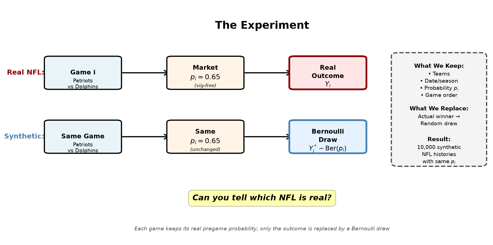

*Figure 1: The experimental design. Each synthetic game has the same teams, date, and pregame probability $p_i$ as the real game, but the outcome is determined by an independent Bernoulli draw rather than the actual result. We simulate 10,000 complete NFL histories this way.*

Each synthetic NFL experiences the **same changing probability environment** as the real league — favorites, underdogs, home field advantage, all reflected in $p_i$ — but outcomes are purely random conditional on those probabilities.

The null hypothesis is **conditional independence**:

$$
H_0: \quad Y_i \perp Y_j \mid \\{p_k\\}_{k=1}^n \qquad \forall i \neq j
$$

If this holds, then once you know the market probability $p_i$ for game $i$, past outcomes $Y_1, \ldots, Y_{i-1}$ contain no additional predictive information. Streaks, momentum, and team-specific patterns should vanish.

---

## First Test: Is the Market Calibrated?

Before testing independence, we verify that the market probabilities $p_i$ are well-calibrated. If $p_i$ systematically over- or under-estimates win probability, the Bernoulli null would be wrong for the wrong reason.

**Calibration** requires that for all $p$:

$$
P(Y_i = 1 \mid p_i = p) = p
$$

We group games by $p_i$ (in 5% increments, merging the rare extreme groups so every group has at least 50 games) and compare the actual home win rate within each bin to its expected value under the Bernoulli model, using the Monte Carlo distribution to establish confidence intervals.

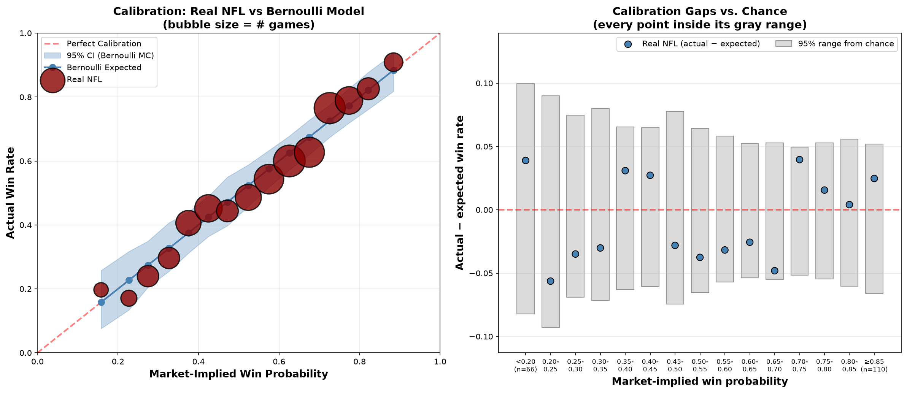

*Figure 2: **Left:** each bubble is a group of games with similar odds (bigger bubble = more games); the dashed diagonal is perfect calibration. Real results track the diagonal and stay inside the blue band that weighted coin flips produce. **Right:** the gap between actual and expected win rate in each group, with the gray bar showing how big a gap chance alone produces for a group that size. Every real gap sits inside its gray bar. Groups at the extremes are wider ("<0.20", "≥0.85") because very lopsided games are rare, and a group of only a handful of games would show large gaps from chance alone.*

**Result:** 0 of 15 probability groups fall outside the 95% confidence interval. Markets are well-calibrated across the full range of pregame probabilities — no systematic overestimation or underestimation of win likelihood.

The **average vig-adjusted home win probability** was 56.6%, and **actual home win rate** was 55.8%. The difference (–0.8 percentage points) is statistically consistent with sampling variation (Monte Carlo percentile: 18.3%).

---

## What Defines an Upset?

For a game where the favorite has probability $p_{\text{fav}} = \max(p_i, 1 - p_i)$, the **upset probability** is simply:

$$
P(\text{upset}) = 1 - p_{\text{fav}}
$$

A 70% favorite is **expected** to lose 30% of the time. Such outcomes are not anomalous if probabilities are correctly calibrated; they are the natural consequence of the 30% tail of the Bernoulli distribution.

Below, we compare the **actual frequency of upsets** (underdog wins) to the distribution generated by 10,000 Bernoulli NFL histories:

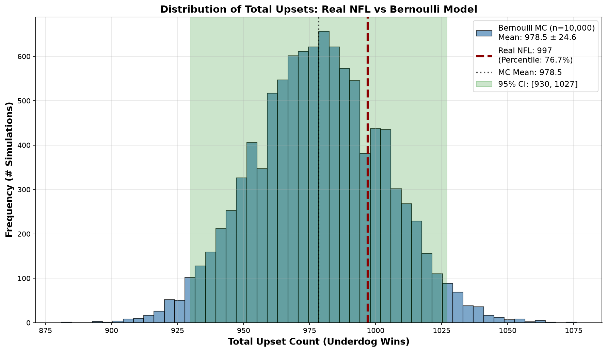

*Figure 3: Distribution of total upset counts from 10,000 Bernoulli simulations (blue histogram). The real NFL had **997 upsets** (red dashed line), which sits comfortably within the Monte Carlo distribution (MC mean: 978.5 ± 24.6, 95% CI: [930, 1027], percentile: 76.7%). The real NFL is not an outlier.*

The real NFL produced 997 upsets out of 2,946 games (33.8%). The Bernoulli model predicts 978.5 ± 24.6 upsets on average. The real NFL sits at the **76.7th percentile** of the Monte Carlo distribution — well within the expected range.

### Do Strong Favorites Get Upset More or Less Often Than Expected?

One might hypothesize that heavy favorites are **overvalued** (upset more than $1 - p_{\text{fav}}$ predicts) or that true underdogs are **undervalued** (win more often than $p$ suggests). The data:

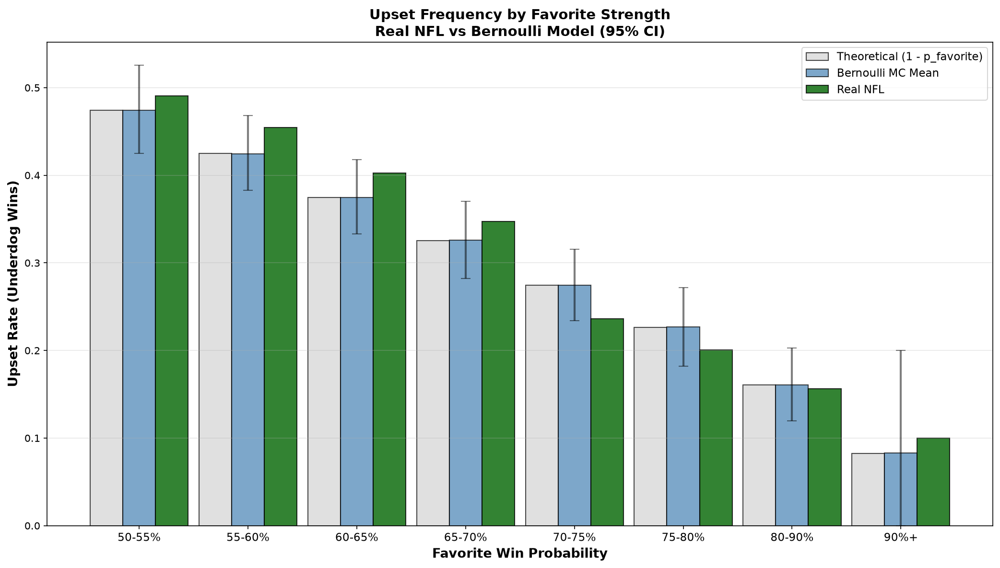

*Figure 4: Upset rates by favorite win probability. Real NFL (red/green bars) compared to theoretical expectation (gray) and Bernoulli Monte Carlo mean (blue) with error bars showing 95% confidence intervals. All 8 bins are consistent with the Bernoulli model (0/8 outside CI). No evidence for favorite-longshot bias or systematic mispricing.*

| Favorite Strength | Real Upset Rate | Bernoulli Expected | Within 95% CI? |
|-------------------|-----------------|-------------------|----------------|
| 50–55% | 49.0% | 47.4% | ✓ |
| 55–60% | 45.5% | 42.5% | ✓ |
| 60–65% | 40.2% | 37.5% | ✓ |
| 65–70% | 34.7% | 32.6% | ✓ |
| 70–75% | 23.6% | 27.4% | ✓ |
| 75–80% | 20.1% | 22.7% | ✓ |
| 80–90% | 15.6% | 16.0% | ✓ |
| 90%+ | 10.0% | 8.3% | ✓ |

**All bins** fall within the 95% confidence interval from Monte Carlo. There is no systematic pattern where strong favorites or longshot underdogs deviate from Bernoulli expectations.

---

## Building 10,000 Random NFL Histories

For each Monte Carlo simulation $m = 1, \ldots, 10{,}000$, we generate a complete NFL season history:

$$
Y_i^{*(m)} \sim \text{Bernoulli}(p_i), \qquad i = 1, \ldots, 2{,}946
$$

Each simulation uses the **exact same** $p_i$ values from the real NFL — same teams, same dates, same market probabilities, same chronological sequence. Only the realized winner is replaced by a coin flip weighted by $p_i$.

These synthetic histories let us ask: **what patterns would we expect to see in a purely random NFL?** And critically: **does the real NFL deviate from that?**

Market participants have access to the kinds of information that plausibly move a line — team strength, home field, injuries, weather, travel, rest, matchups, past performance — and the closing moneyline odds are their collective estimate. We can't see from this data exactly what any given line incorporated or why it settled where it did; we only have the final odds.

We are **not** testing whether those factors matter. We are testing whether, given the closing odds, past outcomes reveal any additional structure the odds didn't already reflect.

---

## Can We Tell Which NFL Is Real?

This is the core question. Given one real NFL and 10,000 synthetic Bernoulli NFLs, can we identify the real one by examining outcome patterns?

### Market Probabilities Vary Across Games

First, confirm that $p_i$ is not constant. If all games were 50-50 coin flips, the Bernoulli null would be trivial. Instead, market probabilities span a wide range, reflecting the changing competitive landscape:

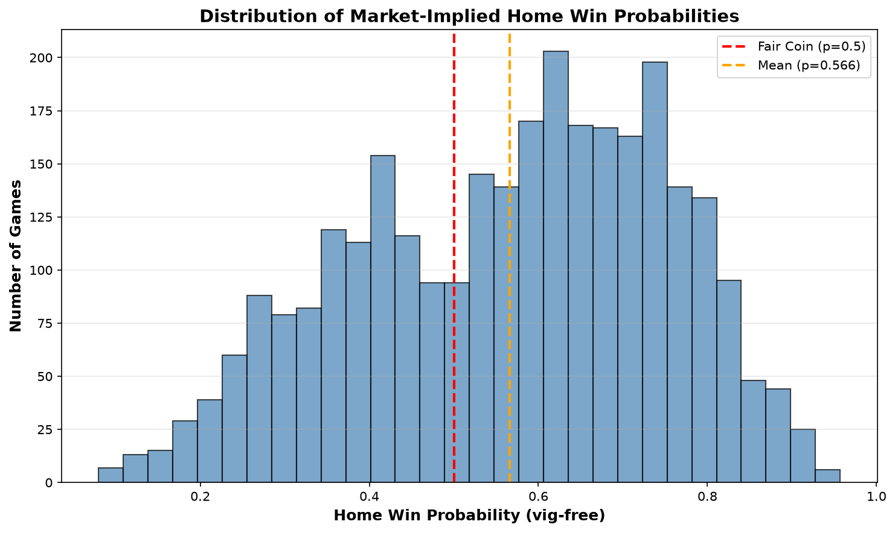

*Figure 5: Distribution of vig-adjusted home win probabilities $p_i$ across 2,946 games. Mean: 56.6% (reflecting home field advantage). The wide spread shows that games are not uniform coin flips — favorites and underdogs exist. The question is whether outcomes conditional on these $p_i$ are Bernoulli.*

The average home team had a 56.6% win probability, but individual games ranged from 8% to 96%. The Bernoulli model respects this variation — each game $i$ has its own weight $p_i$.

### Real games are a little streakier than the model

Do wins and losses cluster more than weighted coin flips would produce? A little. Across all teams, the real NFL has about **5% fewer separate winning and losing runs** than the average random history — 1,338 winning runs versus a simulated 1,408, and 1,346 losing runs versus 1,410. In everyday terms: a run of wins or losses lasts about **2.2 games** in the real NFL versus about **2.1** in the coin-flip model — a difference of roughly a tenth of a game per run.

The gap is tiny per run, but it is consistent enough across 2,946 games to stand out clearly from the 10,000 random histories ($p < 0.001$). So the clustering is real; it is also small.

A separate question is whether the NFL's most *spectacular* streaks are surprising. They are not:

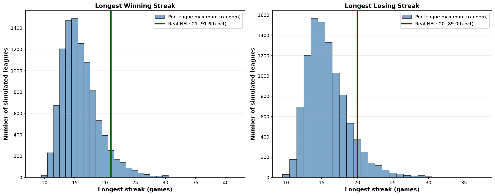

*Figure 6: The single longest winning (left) and losing (right) run produced by each random history, with the real NFL marked. The NFL's longest runs — 21 straight wins, 20 straight losses — sit at the 92nd and 89th percentiles: on the high side, but comfortably inside what weighted coin flips produce on their own. A jaw-dropping streak is not, by itself, evidence of anything beyond chance. The small run-count gap above is the real signal; the record streaks are not.*

We resist calling the clustering "momentum." The data establish only that real results carry a little more persistence than the simplest weighted-coin model — not any particular cause. The more important question is whether that persistence is worth anything to a bettor.

### Measured against the odds, the persistence disappears

A streak is only useful to a bettor if it tells you something the **odds don't already reflect**. So we look at every pair of back-to-back games for the same team — 5,849 of them — and ask two questions about the second game: how often did the team win, and how often did *that game's closing odds* say it would win?

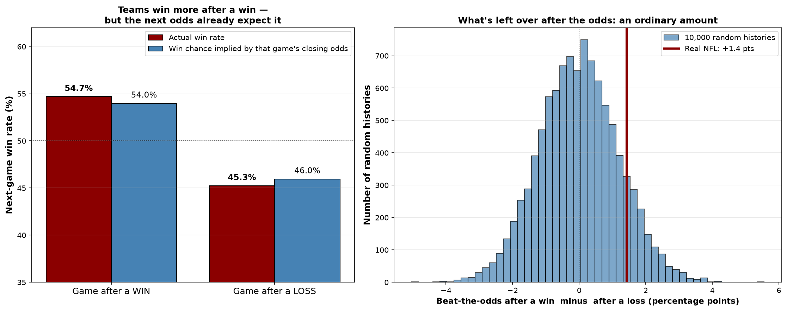

*Figure 7: **Left:** after a win, teams won their next game 54.7% of the time; after a loss, 45.3%. That's a real difference — but the closing odds for those next games already implied 54.0% and 46.0%. **Right:** the part the odds didn't anticipate (actual minus implied, after a win versus after a loss) is +1.4 points in the real NFL, compared with the range produced by 10,000 random histories. It sits inside the normal range.*

| Next game | After a win | After a loss |
|---|---|---|
| Actual win rate | 54.7% | 45.3% |
| Win chance implied by that game's closing odds | 54.0% | 46.0% |
| **Actual minus implied** | **+0.7 pts** | **−0.7 pts** |

**What this shows:** yes, a team that just won is more likely to win its next game — by about 9 percentage points compared with a team that just lost. But the odds for that next game already account for almost all of it (8 of those 9 points). What's left, about 1.4 points between the two situations, is well within what pure chance produces (random histories range from about −2.3 to +2.4). A bettor who backs teams coming off a win is mostly paying for information the odds already contain.

We can't tell from this data *why* the next game's odds differ after a win — it could be the market reacting to the result, or simply that teams that win are, on average, stronger teams facing favorable matchups. Either way, the difference is in the odds you're offered, not hidden from them.

### And it doesn't help predict the next game

The comparison above is descriptive. The decisive test is predictive: start from the game's implied win probability, add a team's recent history, and see whether the *next* game becomes easier to predict — on games the model has never seen. If recent form contained anything the next game's odds were missing, this is where it would show up.

We trained only on earlier games and predicted later ones (never the reverse), comparing five models: the implied win probability alone, and that probability plus last game, last 3 games, last 5 games, or all recent history together.

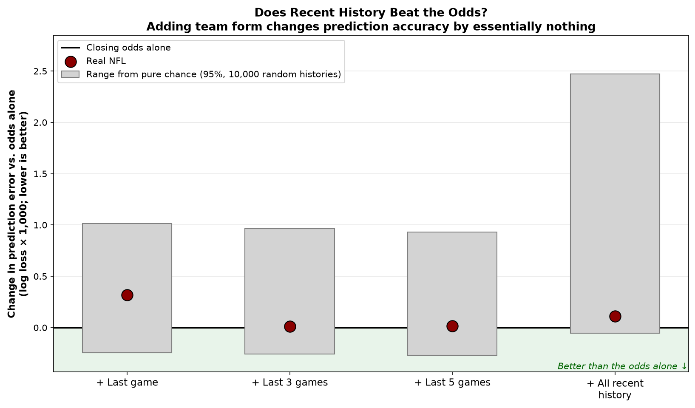

*Figure 8: How much adding each kind of recent history changes prediction error compared with using the closing odds alone. Below zero (green) would mean history helps. The red dots are the real NFL; the gray bars are the range that pure chance produces when the same model is fit to 10,000 random histories. Every real result is at or just above zero and inside the chance range: recent form did not make predictions better. For scale, we planted a known effect into simulated data as a check: if winning a toss-up game gave a team a hidden 3-point boost in its next game, this test would show about −1.3; a 6-point boost would show about −7. Nothing like that appears in the real NFL.*

**What this shows:** these recent-history features — last game, recent form, streak length — do not improve prediction beyond the closing odds. The change in prediction error is between 0.00001 and 0.0003 in log loss, effectively zero. That is a specific, practical result: the obvious things a bettor might read into a team's recent games are already in the odds. It does not prove that *no* signal could ever beat the odds; only that these did not.

The wins and losses matter. They're just not telling us anything about the *next* game that the odds don't already say.

---

## Summary of Statistical Tests

Each null distribution is built by computing the identical statistic within each of the 10,000 simulated leagues (team-averaged quantities are averaged across teams separately within each league; maxima use the distribution of per-league maxima).

The "Departs from coin-flip model?" column marks whether the real NFL differs from the weighted-coin baseline — not whether it beats the market.

| Test | Real NFL | MC mean | 95% CI | Percentile | Two-sided $p$ | Departs from model? |
|------|----------|---------|--------|------------|---------------|------------|
| **Total home wins** | 1,644 | 1,666 | [1,617, 1,716] | 18.3% | — | No |
| **Calibration bins** | 0 / 15 outside CI | ~0.75 / 15 | — | — | — | No |
| **Total upsets** | 997 | 978.5 | [930, 1,027] | 76.7% | — | No |
| **Upset bins** | 0 / 8 outside CI | ~0.4 / 8 | — | — | — | No |
| **Win streak count** *(raw)* | 1,338 | 1,408 | [1,369, 1,446] | 0.0% | <0.001 | Yes, small |
| **Loss streak count** *(raw)* | 1,346 | 1,410 | [1,372, 1,449] | 0.1% | 0.001 | Yes, small |
| **Win rate after a win − after a loss** *(raw)* | +9.5 pts | +4.8 pts | [+2.2, +7.5] | >99.9% | 0.001 | Yes, small |
| **Same gap, measured against the next game's odds** | +1.4 pts | 0.0 pts | [−2.3, +2.4] | 88.4% | 0.233 | No |
| **Recent history added to the odds** *(out-of-sample, change in log loss)* | +0.00001 to +0.0003 | ≈ 0 | chance range ≈ ±0.001 | 5–70% | — | No |

**Verdict:** Raw win/loss sequences are modestly streakier than weighted coin flips (top rows) — a clear but small departure. Once each result is scored against its own game's implied win probability, that extra clustering is no longer visible (the *measured against the odds* row), and recent-history features provide no out-of-sample improvement over the closing odds. Whatever the streaks contain, the odds appear to reflect it.

---

## What Did We Actually Learn?

Return to the central question:

$$
Y_i \mid p_i \overset{?}{\sim} \text{Bernoulli}(p_i)
$$

**What is genuinely there:**
- A small amount of extra clustering. Real NFL runs of wins and losses are about 5% fewer than the weighted-coin model produces — runs lasting about 2.2 games on average instead of 2.1. It is a clear but modest effect, not a dramatic hot hand, and we can't attribute it to any specific cause.

**What the market already reflects:**
- ✓ Well-calibrated probabilities (0/15 calibration groups outside CI)
- ✓ Upsets at the predicted rate (76.7th percentile; 0/8 bins outside CI)
- ✓ Teams do win more often after a win, but the next game's closing odds already account for about 8 of the 9 extra points; the remaining 1.4 points is within the range chance produces
- ✓ Adding recent history to the odds does not improve out-of-sample prediction (walk-forward test), even though the same test detects a planted effect as small as a 3-point boost

**Why both can be true.** A team's raw record and the odds it is given both reflect the same underlying strength, so raw win/loss sequences naturally look clustered. But when we measure each result against the odds it actually faced, the extra clustering is already contained in those odds — there is nothing left over to predict the next result.

**What this does NOT mean:**
- ❌ It does **not** mean games are "random" — skill, coaching, and injuries clearly shape outcomes. The odds reflect them.
- ❌ It does **not** mean the market is perfect — only that no simple public signal (streaks, recent form) improved on it in this NFL sample.
- ❌ It does **not** prove "momentum" in a causal sense; we can only say real results show a little more persistence than the simplest model.

**What this DOES mean:**
- After accounting for the closing odds, past outcomes carry **no measurable additional predictive information** in this data.
- Being right about who wins and beating the odds are different things: the sportsbook can also see the likely winner and set the odds and payout accordingly. A real pattern that is already in the odds is not an edge.

**A note on the analysis history.** Two earlier iterations of the streak test were wrong in instructive ways. The first compared the real league against a mismatched random baseline, which understated the natural variation and made the effect look larger. The second measured raw wins and losses, which conflates a team's clustering with what its game odds already reflected. The comparison used here scores each result against its own game's implied win probability and is backed up by the out-of-sample prediction test. See `docs/persistence_explained.md`.

---

## The Roulette Analogy

A roulette wheel has a **known probability distribution** but **unpredictable individual outcomes**. Even if you know that red has exactly 18/38 probability, you cannot predict the next spin better than that.

The market hypothesis is analogous, with one key difference: **the wheel's weighting changes for every game**.

$$
p_1, p_2, p_3, \ldots, p_n
$$

Each $p_i$ reflects:
- Team strength (which itself evolves)
- Home field advantage
- Injuries, weather, rest, travel
- Matchup-specific factors
- Historical trends

The market may be **excellent at estimating these changing weights** — better than any individual analyst — without being able to **predict the individual realization** beyond the probability itself.

Our NFL results fit this picture. Each game's odds already carry the information you might hope to use — team strength, recent form, matchup — so once you know the current odds, the next result looks unpredictable. The odds track the shifting true probability well enough that the leftover, game-to-game, behaves like chance.

---

## Implications for Sports Betting

The *principle* here isn't specific to football, even though our evidence is. Whenever the odds a sportsbook offers imply a probability close to the true one, and no extra information improves on it, those odds are set slightly worse than fair. This margin — the "vig," or the sportsbook's cut — applies to every wager regardless of result. The NFL data below is a concrete illustration of what that margin does; it is not a claim that every sport's market behaves identically.

A common assumption is that a bettor who wins the majority of wagers must be profitable. The margin makes this false, and the mechanism is clearest in dollar terms.

### An even matchup (–110 both sides)

For two evenly matched teams, a sportsbook typically requires a risk of **\$110 to win \$100** on either side. Across 100 such bets at an exact 50% win rate:

| Outcome | Result |
|---|---|
| 50 wins | +\$5,000 |
| 50 losses | –\$5,500 |
| **Net** | **–\$500** |

A perfect coin-flip record still produces a \$500 loss. Break-even at these odds requires a **52.4%** win rate, not 50%.

### A heavy favorite (an 80/20 matchup)

A team with a true 80% win probability corresponds to fair odds of –400 (risk \$400 to win \$100). A sportsbook shades this to approximately –450, so \$100 at risk returns only **\$22.22** in profit. Across 100 such bets at an exact 80% win rate:

| Outcome | Result |
|---|---|
| 80 wins | +\$1,778 |
| 20 losses | –\$2,000 |
| **Net** | **–\$222** |

An 80-of-100 record still produces a \$222 loss. Because a single loss offsets 4.5 wins, break-even rises from 80% to **81.8%** — above the true win probability.

### Strategies applied to the full dataset

To confirm the effect is not an artifact of two chosen examples, four flat-stake strategies were applied to all 2,946 games (2011–2021) at \$100 per bet, and to 10,000 matched Bernoulli simulations for comparison.

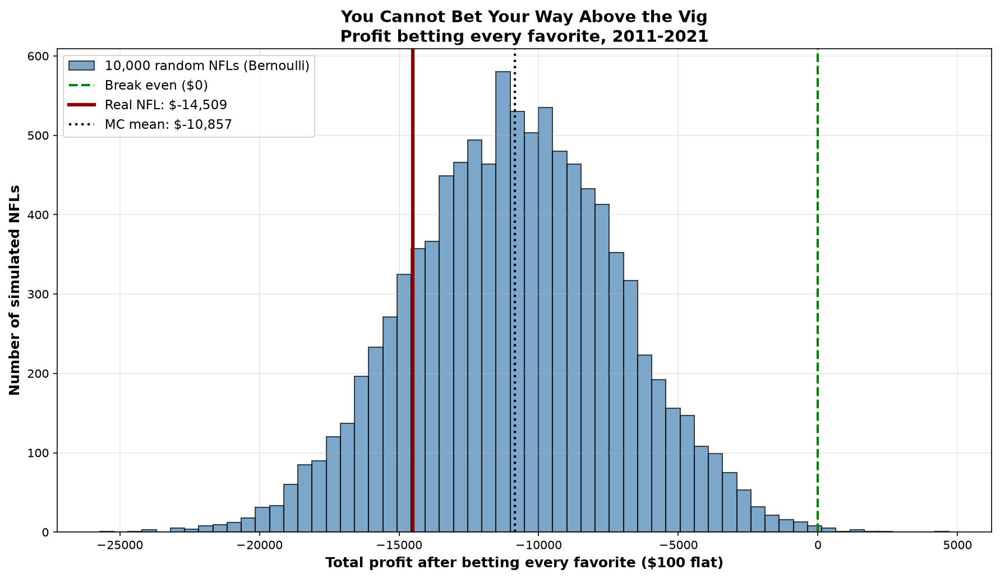

*Figure: Total profit from betting every favorite at \$100 flat over eleven seasons. The blue histogram is 10,000 simulated leagues in which outcomes are weighted coin flips. Almost none finish above \$0 (green line). The observed NFL result (red line) falls within the losing distribution.*

| Strategy | Bets | Observed result | Return | Simulation mean |
|---|---:|---:|---:|---:|
| Bet every favorite | 2,946 | **–\$14,509** | –4.9% | –3.7% |
| Bet even matchups (45–55%) | 367 | **–\$2,650** | –7.2% | –4.5% |
| Bet heavy favorites (≥75%) | 655 | **–\$1,268** | –1.9% | –3.7% |
| Bet every underdog | 2,946 | **–\$10,231** | –3.5% | –3.7% |

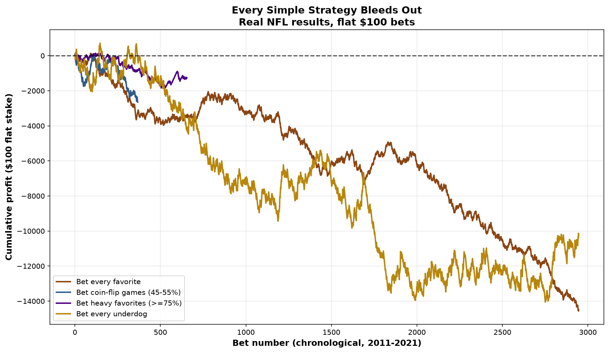

*Figure: Cumulative profit over eleven seasons for four flat-stake strategies. Every trajectory trends downward. No selection rule tested — favorites, underdogs, even matchups, or heavy favorites — returns to break-even.*

The simulation mean is approximately **–3.7% for every strategy**, matching the average sportsbook margin in this data (3.8%). The expected return of any strategy equals the negative of the vig. Favorites, underdogs, and even matchups converge to the same losing rate because, beyond the odds, the outcome carries no exploitable information and the margin is deducted from every wager. The heavy-favorite strategy returned above its simulation mean yet still lost \$1,268, illustrating that a high win rate does not imply a profit.

### Why losses are guaranteed over enough bets

Over a finite number of bets, variance allows some outcomes above break-even; a fraction of the 10,000 simulated leagues finish in profit. This mirrors a roulette wheel: any single session may win, but each spin carries negative expected value. As the number of bets grows, the law of large numbers drives the realized return toward its expectation. Because that expectation is negative for every strategy, sustained betting converges to a loss. No selection rule reverses this, since the profitable outcomes are produced by chance rather than by any repeatable edge.

---

## Methods & Data

### Dataset
- **Source:** [Sportsbook Review Historical Data](https://github.com/flancast90/sportsbookreview-scraper) (2011–2021)
- **Sample:** 2,946 NFL games (regular season + playoffs)
- **Exclusions:** 10 Super Bowls (neutral site, ambiguous "home" team)
- **Odds type:** Closing moneyline (pregame, not live)
- **Vig adjustment:** Normalized probabilities to sum to 1.0

### Probability Calculation
American moneyline odds $m$ are converted to implied probability:

$$
p_{\text{implied}} = 
\begin{cases}
\frac{100}{m + 100} & \text{if } m > 0 \\\\
\frac{|m|}{|m| + 100} & \text{if } m < 0
\end{cases}
$$

Since $p_{\text{home}} + p_{\text{away}} > 1$ (the "vig"), we normalize:

$$
p_{\text{home, vig-free}} = \frac{p_{\text{home}}}{p_{\text{home}} + p_{\text{away}}}
$$

Average vig: **3.83%** (median: 3.79%, range: 1.3%–41.2%).

### Monte Carlo Simulation
- **Simulations:** 10,000 complete NFL histories
- **Method:** For each simulation $m$ and game $i$, draw $Y_i^{*(m)} \sim \text{Bernoulli}(p_i)$
- **Seed:** 42 (reproducible)
- **Compute time:** ~3 minutes on standard CPU

### Sample Size by Season

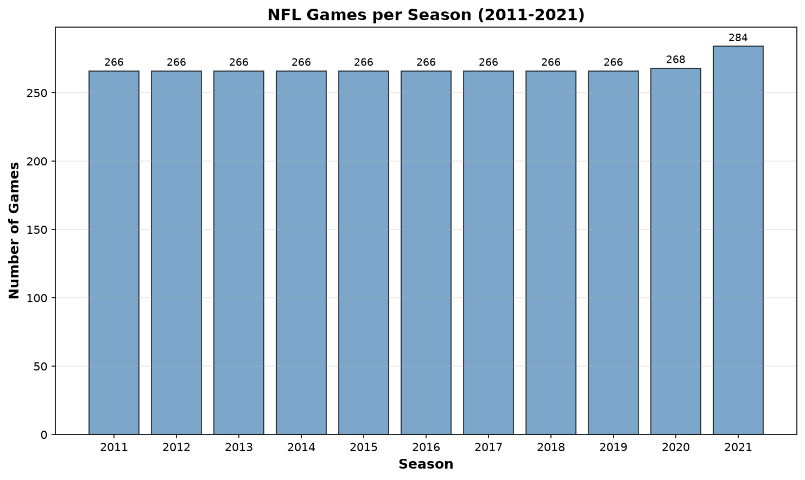

*Figure 9: Number of games per season. Consistent coverage (267–284 games/season) across 11 NFL seasons.*

### Code & Reproducibility
- **Language:** Python 3.12
- **Dependencies:** NumPy, Matplotlib, SciPy
- **Repository:** [github.com/chrissmithphd/just-a-coin-flip](https://github.com/chrissmithphd/just-a-coin-flip)
- **License:** MIT

Run the full analysis pipeline:
```bash
git clone https://github.com/chrissmithphd/just-a-coin-flip.git
cd just-a-coin-flip
python3 -m venv venv && source venv/bin/activate
pip install -r requirements.txt
python scripts/08_run_all_analyses.py
```

---

## Additional Results

### Autocorrelation by Lag: Raw vs. Adjusted

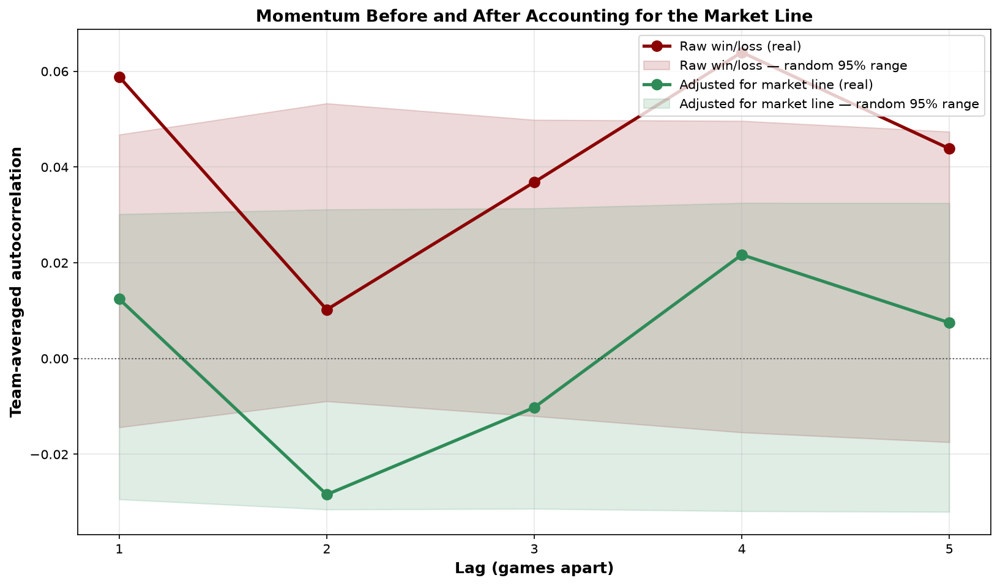

*Figure 10: Team consistency at lags 1–5, measured two ways. Raw win/loss (red) rides above the random range at several lags; measured against each game's implied win probability (green), the values fall within the random band and scatter on both sides of the average rather than lining up above it. The raw pattern does not survive once each result is scored against its odds — at any of the gaps, not just one game apart.*

### Game-Level Residual Autocorrelation

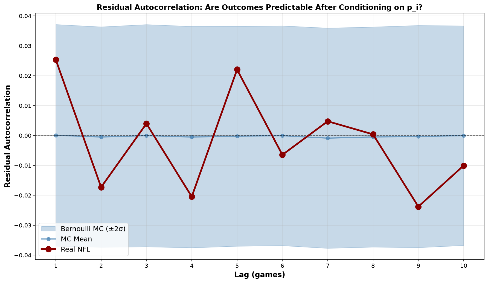

*Figure 11: Autocorrelation of residuals $r_i = Y_i - p_i$ on the global game sequence, lags 1–10. All lags fall within the ±2σ range — no serial structure once each game's implied win probability is accounted for. (This mixes all teams, so it complements the team-level test in "Measured against the odds.")*

### Residual Distribution

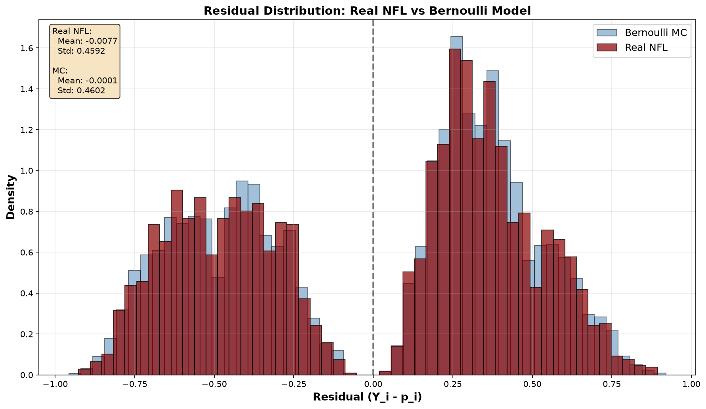

*Figure 12: Distribution of residuals $r_i = Y_i - p_i$. Real NFL (red) overlays the Bernoulli Monte Carlo distribution (blue). Distributions are nearly identical (real: mean = –0.008, std = 0.474; MC: mean = 0.000, std = 0.474).*

---

## Future Work

- [ ] **Extend to 2022–2024:** Add recent seasons (post-legalization era, COVID recovery)
- [ ] **Cross-sport comparison:** Test NBA, MLB, NHL with identical framework
- [ ] **Conditional analyses:**
  - Division vs. non-division games
  - Playoff games (higher stakes)
  - Prime-time vs. early games
  - Outdoor games with extreme weather
- [ ] **Within-team tests:** Per-team hypothesis tests (32 independent tests with Bonferroni correction)
- [ ] **Bayesian calibration:** Hierarchical model for $P(Y \mid p)$
- [ ] **Favorite-longshot bias:** Deep dive on extreme underdogs ($p < 0.15$)
- [ ] **Live betting lines:** Test whether in-game updates remain calibrated

---

## References

- **Efficient markets hypothesis in sports:** Thaler, R. H., & Ziemba, W. T. (1988). Anomalies: Parimutuel Betting Markets. *Journal of Economic Perspectives*, 2(2), 161–174.
- **Market-based probabilities:** Wolfers, J., & Zitzewitz, E. (2004). Prediction Markets. *Journal of Economic Perspectives*, 18(2), 107–126.
- **Data source:** [Sportsbook Review scraper](https://github.com/flancast90/sportsbookreview-scraper) by flancast90

---

## Contact

**Chris Smith** — [@chrissmithphd](https://github.com/chrissmithphd)  
**Project:** [github.com/chrissmithphd/just-a-coin-flip](https://github.com/chrissmithphd/just-a-coin-flip)

---

*Generated with [Claude Code](https://claude.com/claude-code)*
